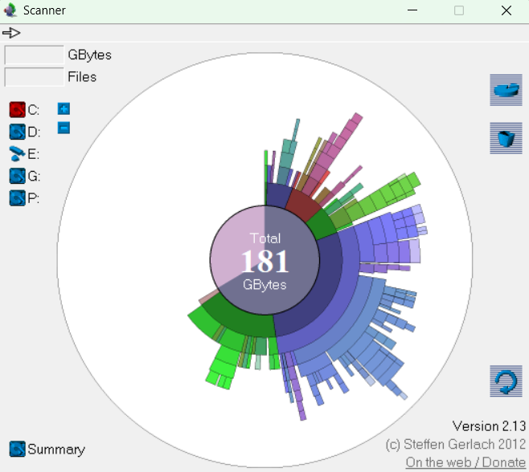

# Scanner 2.13

## Описание

**Scanner 2.13** — это мощная и компактная утилита для анализа дискового пространства под операционную систему Windows, разработанная Steffen Gerlach. Программа предназначена для визуального анализа содержимого жестких дисков, CD/DVD, дискет и других носителей информации.

## Основные возможности

### 📊 Визуализация дискового пространства
- **Диаграмма "Sunburst"** (солнечные лучи) — уникальное графическое представление файлов и папок в виде многоуровневой круговой диаграммы
- Отображение всех крупных файлов и папок со всех уровней директорий одновременно
- Интуитивно понятная цветовая схема для различных типов файлов

### 🔍 Анализ содержимого
- Сканирование жестких дисков, CD/DVD, дискет и других носителей
- Детальный анализ использования дискового пространства
- Возможность навигации вглубь структуры папок для получения подробной информации
- Отображение информации о размере файлов и папок

### 🗑️ Управление файлами
- Быстрое удаление обнаруженных ненужных файлов и папок
- Интерактивное управление через графический интерфейс
- Простая очистка дискового пространства

### 🌐 Локализация
- Автоматическое определение языка системы
- Интерфейс отображается на том языке, который установлен в Windows

## Установка и запуск

1. **Скачайте** архив с программой Scanner 2.13
2. **Распакуйте** содержимое архива в любую папку на компьютере
3. **Запустите** файл `Scanner.exe`
4. Программа готова к работе — установка не требуется!

## Использование

### Быстрый старт
1. Запустите Scanner 2.13
2. Выберите диск или папку для анализа
3. Нажмите кнопку сканирования
4. Изучите результаты в виде интерактивной диаграммы

### Навигация
- **Клик по сектору** — переход в выбранную папку
- **Наведение мыши** — отображение информации о файле/папке
- **Кнопки навигации** — возврат к родительской папке
- **Контекстное меню** — дополнительные действия с файлами

### Анализ результатов
- Размер сектора соответствует размеру файла/папки
- Цвет указывает на тип содержимого
- Самые большие файлы отображаются наиболее заметно
- Возможность сортировки по различным критериям

## Преимущества

✅ **Портативность** — не требует установки, можно запускать с USB  
✅ **Легковесность** — размер всего 208 КБ  
✅ **Быстрота** — мгновенный анализ дискового пространства  
✅ **Наглядность** — уникальная визуализация в виде "sunburst chart"  
✅ **Простота** — интуитивно понятный интерфейс  
✅ **Бесплатность** — полностью бесплатное использование  
✅ **Многоязычность** — поддержка языка системы  

## Сравнение с аналогами

Scanner 2.13 отличается от других анализаторов дискового пространства:
- Уникальная диаграмма "sunburst" вместо обычных древовидных структур
- Компактность и портативность
- Простота использования без излишних функций
- Быстрая работа даже на слабых системах
